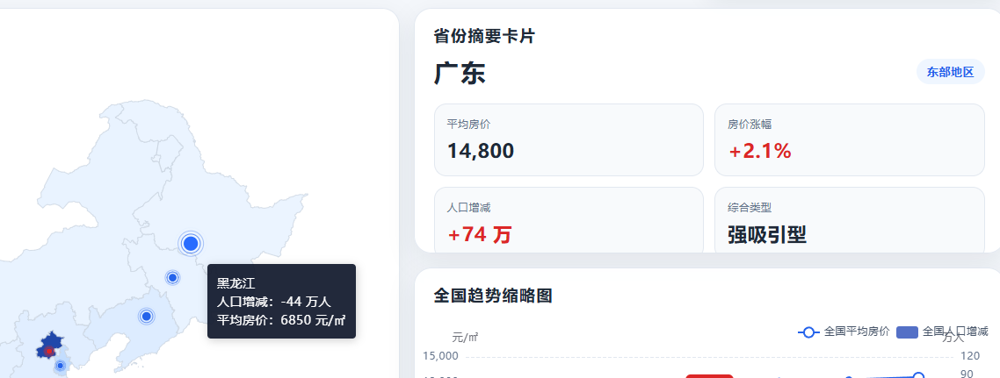
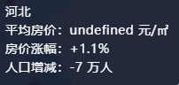
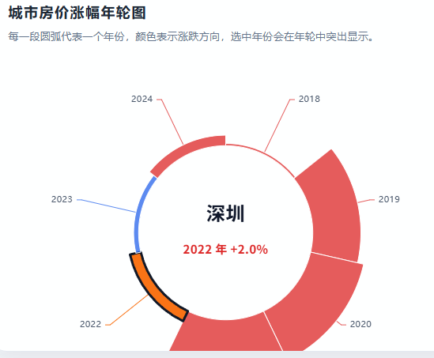

1

将两张中国地图合并，合并的方式为添加按钮（如下图）

按钮具有开关功能（在其他图上实现的那种）

{width="3.3854166666666665in"
height="0.48125in"}

2

去掉省份摘要卡片这一部分，已有的黑框即可（黑框可美化）

{width="4.423611111111111in"
height="1.6194444444444445in"}

3

优化下图的时间选择

{width="2.4506944444444443in"
height="0.6305555555555555in"}

每个年份都设置一个圆点

4

所有网页合并为一个网页，上下滑动展示

5（不急，为最后答辩准备）

这个数据可视化背后的故事

为什么选题，从数据可视化图中得到数据间的什么关系关联，得到什么结论

6（一些小瑕疵）

数据不明

{width="1.7916666666666667in"
height="0.8513888888888889in"}

图中存在遮挡

{width="1.9770833333333333in"
height="0.46041666666666664in"}

图存在遮挡

{width="2.40625in"
height="1.8666666666666667in"}

柱状图表示负的情况下，图形有小问题

{width="1.679861111111111in"
height="0.8506944444444444in"}
