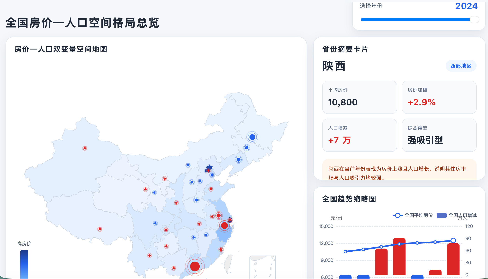
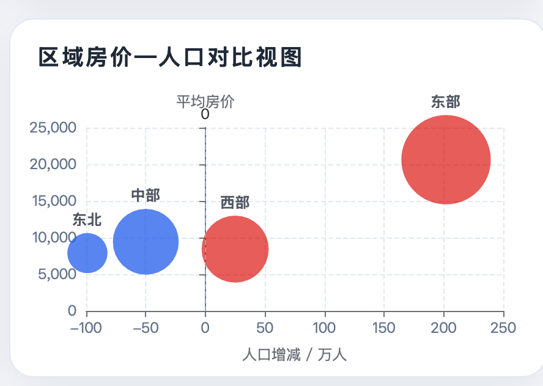
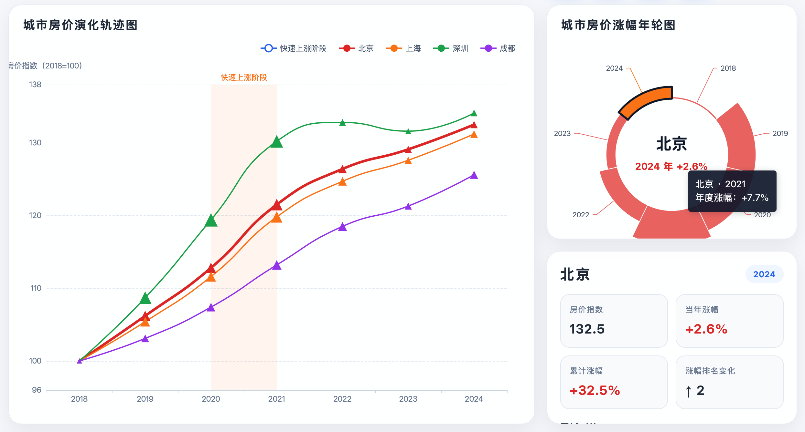
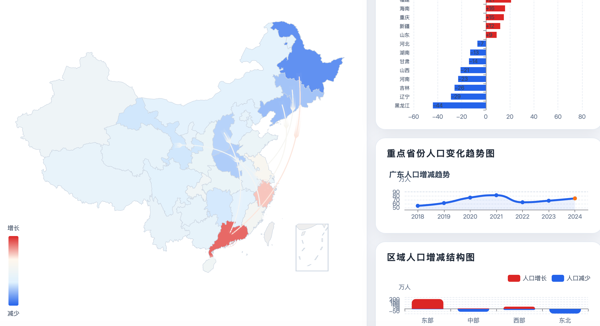
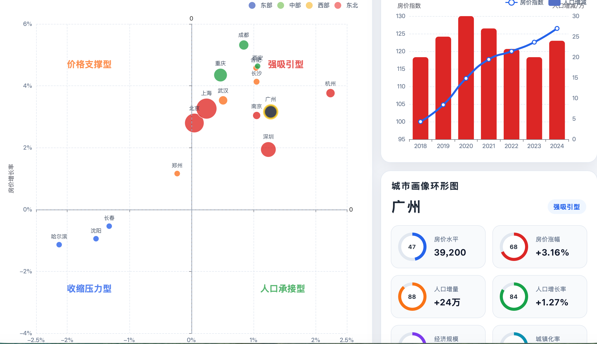

《数据信息》

项目建议书

（2026-春）

  题目：       中国房价变化与人口流动时空可视分析

# 摘 要

近年来，中国城市化进程持续推进，人口跨区域流动日益频繁，不同城市的人口吸引力与住房市场表现呈现出明显差异。人口净流入城市往往伴随着住房需求增长，而人口流出地区则可能面临市场活力下降。房价变化与人口流动之间的关系，已成为社会关注的重要议题。

本项目以中国主要城市房价数据、人口流入流出数据、常住人口变化数据及相关统计年鉴数据为基础，整理形成结构化静态数据资源（JSON
/
CSV），围绕"房价变化"与"人口流动变化"两条主线开展可视化分析。项目将从区域差异、时间演变、城市对比、人口迁移方向等角度，展示不同城市住房市场与人口变化特征，并探索两者之间的关联规律。

系统采用纯前端架构实现，使用 Vue3 构建页面框架，结合 ECharts 与 D3.js
完成交互式图表设计，无需后端服务器即可部署运行。项目目标是打造一个直观、美观、易交互的数据可视化平台，帮助用户理解中国城市发展格局及人口与房地产市场之间的动态关系。

**关键词：**房价变化；人口流动；数据可视化；Vue3；ECharts

#  目 录

[声 明 [ii](#声-明)](#声-明)

[摘 要 [iii](#摘-要)](#摘-要)

[目 录 [iv](#目-录)](#目-录)

[一 引言 [1](#section)](#section)

[1.1 选题背景及意义 [1](#选题背景及意义)](#选题背景及意义)

[1.2 文献综述 [1](#文献综述)](#文献综述)

[1.3 研究目的与实施方案 [2](#研究目的与实施方案)](#研究目的与实施方案)

[1.3.1 研究目的 [2](#研究目的)](#研究目的)

[1.3.2 主要理论与研究方法 [2](#主要理论与研究方法)](#主要理论与研究方法)

[1.3.3 具体实施方案 [3](#具体实施方案)](#具体实施方案)

[二 数据来源与描述 [4](#二-数据来源与描述)](#二-数据来源与描述)

[2.1 数据来源 [4](#数据来源)](#数据来源)

[2.2 数据描述 [4](#数据描述)](#数据描述)

[2.2.1 数据示例 [4](#数据示例)](#数据示例)

[2.2.2 数据表设计 [5](#数据表设计)](#数据表设计)

[三 研究内容与实施方案
[9](#三-研究内容与实施方案)](#三-研究内容与实施方案)

[3.1 页面结构 [9](#页面结构)](#页面结构)

[3.2 页面设计 [9](#页面设计)](#页面设计)

[3.2.1 全国房价-人口空间格局总览
[9](#全国房价-人口空间格局总览)](#全国房价-人口空间格局总览)

[3.2.2 房价变化分析 [11](#房价变化分析)](#房价变化分析)

[3.2.3 人口增减与流动格局分析
[12](#人口增减与流动格局分析)](#人口增减与流动格局分析)

[3.2.4 房价-人口耦合关系分析
[14](#房价-人口耦合关系分析)](#房价-人口耦合关系分析)

[四 实现设计 [16](#四-实现设计)](#四-实现设计)

[4.1 系统总体实现思路 [16](#系统总体实现思路)](#系统总体实现思路)

[4.2 前端框架与页面组织方式
[16](#前端框架与页面组织方式)](#前端框架与页面组织方式)

[4.3 数据组织与加载方法 [16](#数据组织与加载方法)](#数据组织与加载方法)

[4.4 图表实现方法 [17](#图表实现方法)](#图表实现方法)

[4.5 页面交互实现方法 [17](#页面交互实现方法)](#页面交互实现方法)

[4.6 部署方式 [17](#部署方式)](#部署方式)

[五 进度计划与人员分工
[18](#五-进度计划与人员分工)](#五-进度计划与人员分工)

[5.1 进度计划 [18](#进度计划)](#进度计划)

[5.2 人员分工 [18](#人员分工)](#人员分工)

[参考文献 [19](#参考文献)](#参考文献)

# 

# **一 引言**

## 1.1 选题背景及意义

住房问题与人口流动问题是当前中国经济社会发展中的重要议题。随着城市化进程不断推进，大量人口向经济发展水平较高、就业机会较多的城市集聚，城市间人口分布格局持续变化。与此同时，各地房地产市场表现分化明显，一线城市及部分核心二线城市房价长期处于高位，而部分地区市场增长相对缓慢。

人口流动会影响住房需求结构，进而对房价产生影响；房价水平也会反过来影响人口迁移决策。因此，研究房价变化与人口流动之间的关系，不仅有助于理解城市发展规律，也对住房政策制定、区域协调发展及公共资源配置具有现实意义。

传统统计表格难以直观呈现多城市、多年份、多指标之间的复杂关系，而数据可视化能够将抽象数据转化为清晰的图形表达，帮助用户快速发现趋势、比较差异并理解数据背后的逻辑。因此，本项目拟通过可视化方式展示中国城市房价变化与人口流动特征，提升数据表达效果与信息传播效率。

## 1.2 文献综述

围绕"中国房价变化与人口流动"这一主题，现有研究大致可以分为三类：中国人口迁移与流动的空间格局演变；房价对人口流入、居留和迁移选择的影响；人口流动对城市房价和城市发展的反向作用。整体来看，相关研究已经较为丰富，但多以计量分析和经济解释为主，面向公众的数据可视化整合展示仍然相对不足。

在人口流动格局研究方面，刘涛、齐元静、曹广忠^\[^[^1]^\]^基于 2000 年和
2010
年人口普查分县数据，指出中国流动人口空间格局具有较强稳定性，长三角、珠三角和京津冀仍是主要集聚区，同时流动人口向内陆省会和特大城市集中的趋势增强，分布重心出现北移。该研究说明，中国人口流动并非随机扩散，而是明显受城市群、区域发展水平和城镇化进程影响。张耀军等^\[^[^2]^\]^关于中国人口空间流动格局的研究也表明，省际与省内人口流动均具有显著空间集聚特征，东部沿海和核心城市长期保持较强吸引力。

在"房价是否会抑制人口流入"这一问题上，学界并没有完全一致的结论。一部分研究认为，房价上涨显著提高居住成本，会产生一定"挤出效应"。例如，Zhou^\[^[^3]^\]^基于中国流动人口动态监测调查数据研究发现，更高的住房价格会影响迁移者的技能选择，低技能流动人口更容易被高房价城市排斥，从而导致迁移人口出现正向筛选。类似地，一些中文研究指出，高房价会削弱流动人口的长期留城意愿和回流决策。

但另一方面，也有研究认为，高房价并不必然阻止人口流入，尤其在就业机会、公共服务和发展前景更强的大城市中，这种抑制作用可能被抵消。黎嘉辉^\[^[^4]^\]^关于"城市房价、公共品与流动人口留城意愿"的研究发现，房价对流动人口留城意愿呈倒U形影响，即在一定区间内，较高房价反而可能对应更强的留城意愿，因为高房价往往也意味着更优质的教育、医疗和公共资源；只有当住房负担超过某个阈值后，抑制效应才会显现。这说明，房价在迁移决策中的作用并不是单向的，而是与城市综合吸引力共同发挥作用。任元明等^\[^[^5]^\]^则把城市房价、人口流动和全要素生产率纳入统一框架，基于2005-2018年194个城市数据分析发现，人口流动在房价与城市经济绩效之间具有中介作用，说明房价与人口并非孤立变量，而是嵌入城市发展系统中的联动因素。

近年的研究还开始强调人口迁移格局的长期演化特征。古恒宇等^\[^[^6]^\]^基于2000-2020年人口普查数据的研究表明，中国省际人口迁移总体上仍呈现"东部集聚、中西部和东北净流出"的基本格局，但不同区域之间的迁移联系和网络结构在持续变化，部分中西部核心城市和都市圈的吸引力正在上升。这意味着，如果项目只做单一年份的静态对比，往往难以揭示真正的趋势变化，因此从时间维度展示人口与房价的共同演变具有必要性。

综上，已有研究为理解房价与人口流动之间的关系提供了坚实基础，但仍存在两点不足。第一，多数研究侧重计量模型和因果解释，结论分散在不同论文中，普通用户较难形成直观认知。第二，现有研究较少将房价指数、人口迁移格局、城市比较和时间演变整合到统一的交互式可视化系统中。因此，本项目拟在已有研究基础上，选取公开统计数据与迁移数据，通过地图、时序图、城市对比图和迁移关系图等方式，对中国房价变化与人口流动变化进行综合呈现。

## 1.3 研究目的与实施方案

### 1.3.1 研究目的

本项目围绕"中国房价变化与人口流动"这一主题，旨在整合公开统计数据与多源城市数据，构建一个具有分析性、交互性与展示性的可视化平台，使用户能够从时间与空间两个维度直观理解中国城市发展格局的变化趋势。包括整理中国主要城市房价变化数据、人口流动数据及常住人口变化数据，构建结构化数据资源库；展示不同城市房价水平、涨跌趋势及区域差异，反映中国住房市场的阶段性变化特征；刻画人口迁移方向、人口集聚现象与城市吸引力变化，展示人口流动的时空演化规律；分析房价变化与人口流动之间的关联关系，探索人口集聚、城市发展与住房市场之间的互动机制；利用网页交互式可视化方式提升数据表达效果，为公众理解城市发展与区域差异提供直观参考。

### 1.3.2 主要理论与研究方法

为实现上述目标，本项目将综合运用数据分析理论、可视化设计理论及前端开发技术。

**统计分析方法。**对房价指数、人口增量、迁移规模等数据进行描述性统计、趋势分析和对比分析，提取关键变化特征。

**时空分析方法。**结合年份维度与城市地理位置，分析不同区域房价变化与人口流动的空间分布特征及时间演进规律。

**相关性分析方法。**通过散点图、分组比较等方式观察房价变化与人口流入流出之间的关系，为后续解释提供依据。

**信息可视化理论。**依据信息层级、视觉编码、交互反馈等原则，将抽象数据转化为地图、折线图、柱状图、迁移图、热力图等图形表达，提高信息传递效率。

**前端开发技术。**采用 Vue3 构建页面结构与组件化系统，使用 ECharts
实现常规统计图表，使用 D3.js
实现定制化动态图形与交互效果，并通过静态资源部署实现项目落地。

### 1.3.3 具体实施方案

本项目总体采用"数据整理---分析建模---可视化设计---前端实现---部署展示"的技术路线。

**数据采集与整理。**收集国家统计局、统计年鉴、人口普查公报、城市公开统计资料及迁徙平台公开数据，筛选主要城市的房价、人口与迁移指标，并统一整理为
CSV / JSON 格式数据文件。

**数据预处理。**对原始数据进行清洗、去重、缺失值处理、字段标准化和城市名称统一，保证不同来源数据能够融合使用。

**数据分析与指标构建。**计算房价涨跌幅、人口增减规模、人口净流入水平、城市排名等指标，并形成适合展示的数据结果。

**可视化页面设计。**围绕项目主题设计多个展示页面，例如，全国地图：展示各城市房价水平或人口变化分布；时间趋势页：展示重点城市房价变化折线图；城市对比页：展示不同城市人口与房价差异；人口迁移页：展示城市间迁移流向关系；综合分析页：展示房价与人口关系散点图或联动分析图。

**前端系统开发。**使用 Vue3
搭建项目框架，按模块开发页面组件；通过ECharts与
D3.js接入图表，实现筛选、切换、联动、悬浮提示等交互功能。

**测试与部署。**完成系统功能测试与界面优化后，将项目以静态网页形式部署，实现本地运行或在线展示。

#  **二 数**据来源与描述

## 2.1 数据来源

本项目围绕"中国房价变化与人口流动"主题开展数据整理与可视化分析，所使用数据主要来自国家统计部门、人口普查资料、公开统计年鉴及互联网公开迁徙平台。

房价数据主要来源于国家统计局发布的"70个大中城市商品住宅销售价格变动情况"及国家数据平台相关城市住宅价格指标数据。该类数据按月发布，覆盖中国主要城市，包含新建商品住宅和二手住宅价格指数，可用于反映城市房价变化趋势、区域差异及阶段性波动情况。

人口数据主要来源于《中国统计年鉴》、各年度国民经济和社会发展统计公报、第七次全国人口普查公报及各城市统计公报。相关数据包括城市常住人口规模、年度人口增量、城镇化水平等指标，可用于衡量城市人口变化及人口集聚趋势。其中，常住人口数据能够较好反映城市实际人口承载与长期人口吸引力，因此将作为项目分析人口变化的重要指标。

地图数据主要来源于公开行政区划GeoJSON文件、中国省级与城市级边界数据资源等，用于绘制全国地图、省份地图及城市分布图。相关地理数据将用于实现区域着色地图、迁移路径图和空间分布图等可视化内容。

## 2.2 数据描述

### 2.2.1 数据示例

+----------------+----------------+-----------------+-----------------+
| 城市           | 环比           | 同比            | 1-6月平均       |
|                +----------------+-----------------+-----------------+
|                | 上月=100       | 上月=100        | 上月同期=100    |
+----------------+----------------+-----------------+-----------------+
| 北京           | 99.7           | 95.9            | 94.9            |
+----------------+----------------+-----------------+-----------------+
| 天津           | 99.8           | 98.2            | 97.9            |
+----------------+----------------+-----------------+-----------------+
| 石家庄         | 99.8           | 96.9            | 96.4            |
+----------------+----------------+-----------------+-----------------+
| 太原           | 100.1          | 101.3           | 101.1           |
+----------------+----------------+-----------------+-----------------+
| \...           | \...           | \...            | \...            |
+----------------+----------------+-----------------+-----------------+

表1：2025年6月70个大中城市新建商品住宅销售价格指数

+-------------+------------------------+-------------+-------------+--------------+
| 年份        | 新建商品房平均销售价格 | 住宅        | 办公楼      | 商业营业用房 |
|             |                        |             |             |              |
| 地区        |                        |             |             |              |
+-------------+------------------------+-------------+-------------+--------------+
| 1998        | 2063                   | 1854        | 5552        | 3170         |
+-------------+------------------------+-------------+-------------+--------------+
| 2000        | 2112                   | 1948        | 4751        | 3260         |
+-------------+------------------------+-------------+-------------+--------------+
| 北京        | 31976                  | 38673       | 34569       | 19793        |
+-------------+------------------------+-------------+-------------+--------------+
| 天津        | 14819                  | 14967       | 13130       | 14080        |
+-------------+------------------------+-------------+-------------+--------------+
| \...        | \...                   | \...        | \...        | \...         |
+-------------+------------------------+-------------+-------------+--------------+

表2：2025中国统计年鉴-按用途分新建商品房平均销售价格 单位：元/平方米

  ----------- ----------- ----------- ----------- ----------- -----------
  地区        2015        2016        2017        2018        \...

  北京        2188        2195        2194        2192        \...

  天津        1439        1443        1410        1383        \...

  石家庄      7345        7375        7409        7426        \...

  \...        \...        \...        \...        \...        \...
  ----------- ----------- ----------- ----------- ----------- -----------

表3：2025中国统计年鉴-分地区年末人口数 单位：万人

### 2.2.2 数据表设计

房价csv设计：

  ----------------------- ----------------------- -----------------------
  字段名                  含义                    例子

  city                    城市名                  北京

  province                省份/直辖市             北京

  year                    年                      2024

  month                   月                      1

  date                    年月字符串              2024-01

  new_house_index         新房价格指数            101.2

  second_hand_index       二手房价格指数          99.8

  new_house_yoy           新房同比                2.3
  ----------------------- ----------------------- -----------------------

表4：商品房月度价格csv表字段设计

房价json设计：

\[

{

\"city\": \"北京\",

\"province\": \"北京\",

\"series\": \[

{

\"date\": \"2024-01\",

\"year\": 2024,

\"month\": 1,

\"new_house_index\": 100.5,

\"second_hand_index\": 99.2,

\"new_house_yoy\": 1.8,

\"second_hand_yoy\": -0.6

},

{

\"date\": \"2024-02\",

\"year\": 2024,

\"month\": 2,

\"new_house_index\": 100.3,

\"second_hand_index\": 98.9,

\"new_house_yoy\": 1.5,

\"second_hand_yoy\": -0.9

}

\]

},

{

\"city\": \"上海\",

\"province\": \"上海\",

\"series\": \[

{

\"date\": \"2024-01\",

\"year\": 2024,

\"month\": 1,

\"new_house_index\": 100.7,

\"second_hand_index\": 99.5,

\"new_house_yoy\": 2.1,

\"second_hand_yoy\": -0.4

}

\]

}\]

人口csv设计：

  ----------------------- ----------------------- -----------------------
  字段名                  含义                    例子

  city                    城市                    北京

  province                省份                    北京

  year                    年份                    2024

  population              常住人口（万人）        2183

  population_growth       人口增量（万人）        -2.6

  growth_rate             人口增长率              -0.12

  urbanization_rate       城镇化率（可选）        87.5
  ----------------------- ----------------------- -----------------------

表5：年度地区人口变化csv字段设计

人口json设计：

\[

{

\"city\": \"北京\",

\"province\": \"北京\",

\"series\": \[

{

\"year\": 2020,

\"population\": 2189,

\"population_growth\": -1.5,

\"growth_rate\": -0.07

},

{

\"year\": 2021,

\"population\": 2188,

\"population_growth\": -1.0,

\"growth_rate\": -0.05

},

{

\"year\": 2022,

\"population\": 2184,

\"population_growth\": -4.0,

\"growth_rate\": -0.18

}

\]

},

{

\"city\": \"深圳\",

\"province\": \"广东\",

\"series\": \[

{

\"year\": 2020,

\"population\": 1756,

\"population_growth\": 12.0,

\"growth_rate\": 0.69

}

\]

}

\]

#  **三 研**究内容与实施方案

## 3.1 页面结构

页面结构分为四页。

页面一：全国总览

页面二：房价变化分析

页面三：人口变化分析

页面四：房价与人口关系分析

## 3.2 页面设计

### 3.2.1 全国房价-人口空间格局总览

{width="5.590972222222222in"
height="3.204861111111111in"}

{width="1.9909722222222221in"
height="1.4166666666666667in"}

图3. 1 全国房价-人口空间格局总览页面示意

全国房价-人口空间格局总览页面作为系统的入口页面，从宏观层面展示中国各地区房价水平、房价变化和人口增减之间的空间分布关系。

#### 3.2.1.1 房价-人口双变量空间地图

房价-人口双变量空间地图作为页面主视图，以中国地图为基础，同时编码房价和人口两个变量。其中，省份底色表示房价水平或房价涨幅，颜色越深代表房价水平越高或涨幅越明显；省份中心位置叠加圆点表示人口增减规模，圆点大小表示人口变化幅度，圆点颜色表示人口增加或减少。

通过这种双变量编码方式，地图能够同时展示"房价差异"和"人口变化"两个维度。用户可以直观看到哪些地区房价较高且人口持续增长，哪些地区房价较低但人口增长较快，以及哪些地区面临人口减少但房价仍较高的情况。

#### 3.2.1.2 省份摘要卡片

当用户点击地图中的某一省份时，右侧省份摘要卡片将同步更新。摘要卡片展示该省份在当前年份的核心指标，包括平均房价、房价涨幅、人口增减、人口变化方向、房价排名和人口增减排名等内容。

摘要卡片将地图中的视觉编码转化为具体数值说明，帮助用户理解某一省份在全国格局中的位置。例如，当用户点击广东省时，卡片可以显示其房价水平、人口增长规模以及与全国平均水平的比较结果，从而形成从空间观察到具体数据解释的分析过程。

#### 3.2.1.3 全国趋势缩略图

全国趋势缩略图用于展示全国平均房价和全国人口增减的年度变化趋势。该图位于页面右侧或底部，采用双轴折线与柱状图组合：折线表示全国平均房价变化，柱状图表示全国人口增减规模。用户切换年份时，趋势图中对应年份的节点将被高亮显示。该视图主要用于补充时间维度，使用户不仅能够观察当前年份的空间格局，还能够了解全国整体趋势的变化过程。

#### 3.2.1.4 区域对比视图

区域对比视图用于展示东部、中部、西部和东北地区在房价与人口变化上的差异。通过区域对比视图，用户可以发现不同区域之间的发展差异。例如，东部地区可能表现为房价水平较高且人口增长明显；东北地区可能表现为人口减少较明显；中西部地区则可能呈现部分核心省份人口回流或增长的现象。

#### 3.2.1.5 页面交互设计

本页面通过多视图联动实现从全国宏观观察到省份局部分析的过程。用户可以通过年份滑块切换不同年份，地图颜色、人口圆点、摘要卡片和趋势图同步更新。用户点击地图中的省份后，该省份在地图中高亮显示，右侧摘要卡片显示其核心指标，全国趋势图中同步标注该省份对应年份的变化情况，区域对比视图中高亮该省所属区域。

### 3.2.2 房价变化分析

{width="6.294444444444444in"
height="3.3819444444444446in"}

图3.2 房价变化分析页面示意

房价变化分析页面主要用于展示不同城市房价水平及涨跌幅的时间演化过程。本页面采用"城市房价演化轨迹图"和"城市房价涨幅年轮图"组成复合视图，从时间趋势、涨跌幅变化和城市对比三个角度综合呈现中国主要城市房价变化特征。

#### 3.2.2.1 城市房价演化轨迹图

城市房价演化轨迹图作为页面主视图，用于展示多个城市在不同年份中的房价指数变化路径。横轴表示年份，纵轴表示房价指数或平均房价水平，每条折线代表一个城市的房价变化轨迹。

在每个城市折线的年份节点上，根据当年房价涨跌幅设置不同的视觉符号：房价上涨年份使用向上三角形表示，房价下降年份使用向下三角形表示，涨跌幅越大，节点符号越明显。通过这种设计，用户不仅能够观察房价总体走势，还能够直接识别某一城市在哪些年份出现明显上涨或下降。

#### 3.2.2.2 城市房价涨幅年轮图

城市房价涨幅年轮图作为页面辅助视图，用于展示单个城市多年房价涨跌幅的整体结构。该视图采用环状图形式，每一段圆弧对应一个年份，圆弧颜色表示该年房价上涨或下降方向，圆弧长度或透明度表示涨跌幅大小。图形中心显示当前选中城市名称、当年涨幅和累计涨幅。

#### 3.2.2.3 联动交互设计

本页面将实现主视图与辅助视图之间的联动。当用户点击城市房价演化轨迹图中的某个折线节点时，右侧年轮图和信息卡片将同步更新，显示该城市在对应年份的详细信息，包括当年房价涨幅、相对于起始年份的累计涨幅、该城市在所有城市中的涨幅排名变化，以及与东部、中部、西部等区域平均水平的对比。。

### 3.2.3 人口增减与流动格局分析

{width="6.2875in"
height="3.4256944444444444in"}

图3.3 人口流动分析页面示意

人口增减与流动格局分析页面主要用于展示中国各省人口规模变化的空间分布、净增长与净减少差异，以及人口变化可能反映出的区域流动趋势。

#### 3.2.3.1 人口增减空间格局图

人口增减空间格局图作为页面主视图，以中国地图为基础展示不同省份在选定年份的人口增减情况。地图颜色表示人口变化方向和幅度：红色表示人口增加，蓝色表示人口减少，颜色越深代表增减幅度越大。用户可以通过年份滑块切换不同年份，观察各省人口变化格局随时间的演变。

地图中叠加若干趋势性箭头，用于表示人口可能向核心城市群和经济活跃地区集聚的总体趋势。例如，当中西部部分省份人口减少而长三角、珠三角等地区人口增加时，系统可用半透明弧线表示由人口减少区域向人口增长区域集聚的趋势。但是，这类箭头并不表示精确的省际迁移数量，而是基于人口增减结果、区域经济吸引力和城市群分布所形成的趋势性可视化表达。

#### 3.2.3.2 人口净增长-净减少发散排名图

人口净增长-净减少发散排名图用于同时展示人口增加和人口减少最明显的地区。该图以中轴线为基准，右侧表示人口净增长省份，左侧表示人口净减少省份。条形长度表示人口增减规模，颜色区分增长与减少。

#### 3.2.3.3 重点省份人口变化趋势图

重点省份人口变化趋势图用于展示用户选中省份的历年人口增减情况。用户点击地图上的某一省份后，右侧趋势图将同步更新，显示该省在不同年份的人口增量变化。通过该图，用户可以观察某一省份人口变化是否具有持续增长、持续减少或阶段性波动特征。

#### 3.2.3.4 区域人口增减结构图

区域人口增减结构图用于从区域层面概括人口变化格局，采用"区域-增长/减少-省份"的结构分解图。该图左侧为区域类型，如东部、中部、西部、东北；中间为人口增长或人口减少；右侧为具体省份。连线粗细表示人口增减规模。通过这种方式，用户可以观察哪些区域整体更偏向人口增长，哪些区域人口减少较明显，从而在不依赖精确迁移流向数据的情况下，仍然展示人口变化的结构特征。

### 3.2.3.5 页面交互设计

用户切换年份时，地图颜色、趋势箭头、发散排名图和区域结构图同步更新。用户点击地图上的某一省份后，该省在地图中高亮显示，右侧人口变化趋势图同步展示该省历年人口增减情况，发散排名图中对应条形也会被高亮。

### 3.2.4 房价-人口耦合关系分析

{width="6.2965277777777775in"
height="3.6277777777777778in"}

图3.4 房价-人口耦合关系分析页面示意

房价-人口耦合关系分析页面主要用于探索不同城市房价变化与人口变化之间的关系，采用"房价-人口四象限耦合散点图、城市房价---人口双轴趋势图、城市画像环形图"的复合分析视图设计，从宏观分布、城市个案和综合特征三个层面分析房价与人口之间的互动关系。

#### 3.2.4.1 房价-人口四象限耦合散点图

房价-人口四象限耦合散点图作为页面主视图，用于展示不同城市在房价变化和人口变化两个维度上的分布关系。横轴表示人口增减率，纵轴表示房价增长率，每个点代表一个城市。点的大小表示城市经济规模或人口规模，点的颜色表示区域类型，如东部、中部、西部和东北地区。

该散点图以横轴和纵轴的零值为分界线，将城市划分为四种类型：

**强吸引型城市**，位于右上象限，表现为人口增长且房价上涨，说明该类城市同时具有较强人口吸引力和住房市场活跃度。

**价格支撑型城市**，位于左上象限，表现为人口减少但房价上涨，可能说明该类城市房价受到核心资源、政策预期或存量住房需求支撑。

**收缩压力型城市**，位于左下象限，表现为人口减少且房价下跌或增长乏力，说明该类城市可能面临人口流失和住房市场活力下降的双重压力。

**人口承接型城市**，位于右下象限，表现为人口增长但房价下降或涨幅较弱，可能说明该类城市具有人口承接能力，但住房市场价格仍较平稳。

#### 3.2.4.2 城市房价-人口双轴趋势图

城市房价-人口双轴趋势图用于展示用户选中城市的长期变化过程。用户点击四象限散点图中的某个城市后，右侧趋势图同步更新。图中折线表示该城市房价指数变化，柱状图表示该城市人口增减变化，两者共用同一时间轴。

该视图主要用于解释散点图中的城市位置来源。例如，当某个城市位于"强吸引型"象限时，用户可以通过趋势图观察其是否长期保持人口增长和房价上涨；当某个城市位于"价格支撑型"象限时，用户可以进一步判断其房价上涨是否只是短期现象，还是长期趋势。

#### 3.2.4.3 城市画像环形图

城市画像环形图用于展示选中城市的综合特征。采用环形指标图的方式表示多个城市指标，使页面视觉表达更加直观。该图包括房价水平、房价涨幅、人口增量、人口增长率、经济规模和城镇化率等指标。每个指标使用一个环形进度条表示，进度越高代表该指标在样本城市中越突出。通过城市画像环形图，用户可以快速了解某个城市在房价、人口和经济方面的综合特征，并与其在四象限图中的类型相互印证。

#### 3.2.4.4 页面交互设计

用户点击四象限散点图中的城市点后，该城市在散点图中高亮显示，右侧双轴趋势图更新为该城市历年房价和人口变化情况，城市画像环形图同步更新该城市的综合指标。用户还可以通过区域筛选器选择东部、中部、西部或东北地区，观察不同区域城市在房价---人口关系上的差异。

#  **四 实现设计**

本项目拟采用纯前端实现方式，构建一个基于Vue3+ECharts的交互式数据可视化系统。系统不依赖复杂后端服务，主要通过本地整理后的静态数据文件完成数据加载、处理与展示，并部署为可直接访问的Web页面。

## 4.1 系统总体实现思路

系统整体采用"数据层-视图层-交互层"的实现结构。

数据层主要负责存放和读取经过预处理后的房价与人口流动数据，包括省级年度房价、省级人口净流入净流出、重点城市人口规模、城市房价增速等内容。数据以JSON或CSV形式保存在项目本地目录中，由前端页面在加载时直接读取。

视图层主要由多个Vue页面组件组成，对应前文设计的若干页面。每个页面内部再划分为若干图表组件，用于分别展示地图、折线图、热力图、柱状图、散点图和雷达图等可视化内容。

交互层主要负责实现图表之间的联动，包括鼠标悬浮提示、点击更新图表、城市画像等，从而实现从宏观总览到局部细节的分析过程。

## 4.2 前端框架与页面组织方式

本项目拟采用Vue3作为前端框架。Vue3具有组件化开发、响应式管理和页面组织清晰等特点。

在实现上，可将系统组织为如下结构：

views/HomeView.vue：页面1，全国总览页

views/PriceAnalysisView.vue：页面2，房价变化分析页

views/PopulationFlowView.vue：页面3，人口流动分析页

views/RelationView.vue：页面4，房价与人口关系分析页

同时，也可进一步拆分出可复用组件，例如：components/ChinaMap.vue等。

## 4.3 数据组织与加载方法

由于本项目采用纯前端静态部署，因此数据文件需要在前期完成清洗、整理和结构化。按照"页面功能导向"组织数据，例如province_house_price.json：各省各年份房价数据；province_population_flow.json：各省人口净流入净流出数据。

在前端实现中，可读取对应目录下的静态JSON文件，也可以在开发阶段直接引入本地数据模块。

## 4.4 图表实现方法

本项目的可视化部分主要由 ECharts
实现。ECharts提供了地图、折线图、柱状图、热力图、散点图和雷达图等多种图表类型，能够覆盖本项目的展示需求。

## 4.5 页面交互实现方法

本项目的交互以ECharts自带事件机制和Vue的响应式更新为主，不依赖复杂的可视化框架。主要交互方式包括以下几类。

**悬浮提示。**所有图表均可显示详细数值信息，如省份名称、房价数值、人口净流入量或城市画像指标等，用于提升图表的可读性。

**点击联动。**页面1点击地图更新趋势图和排名图；页面2点击热力图更新涨幅排名；页面3点击省份地图更新该省人口趋势与城市对比；页面4点击散点更新雷达图和双指标趋势图。

**筛选切换。**页面1可通过切换按钮在"房价""人口""房价增速""人口增速"之间切换地图指标；页面4可通过下拉框筛选东部、中部和西部城市，从而减少散点图密度，突出特定区域特征。

**窗口自适应。**为保证页面在不同屏幕尺寸下正常显示，需要在图表初始化后监听浏览器尺寸变化，并进行重绘。这种方法适合本项目的响应式网页展示形式。

## 4.6 部署方式

本项目采用纯前端静态资源展示，部署较为简单。开发完成后，可将项目构建为静态文件，并部署到GitHub
Pages或Netlify等平台。

#  五 进度计划与人员分工

## 5.1 进度计划

  ------------------------------------ ----------------------------------
  第7周前                              开题立项、完成项目建议书

  第9周前                              完成数据获取、数据清洗和整理

  第13周前                             完成前端框架和视图实现

  第14周前                             完成打包、部署和测试

  第15周前                             完成PPT和答辩准备
  ------------------------------------ ----------------------------------

## 5.2 人员分工

  ------------------------------------ ----------------------------------
  张子劼                               前端页面设计；监督和安排工作

  金松昊                               前端页面设计

  谢全鑫                               前端页面设计

  周小枫                               前端页面设计

  张祥为                               数据获取和处理

  郑宇宸                               数据获取和整理

  王宏                                 数据处理；部署和测试
  ------------------------------------ ----------------------------------

#  参考文献

[^1]: ^\[\]^ 刘涛, 齐元静, 曹广忠.
    中国流动人口空间格局演变机制及城镇化效应------基于2000和2010年人口普查分县数据的分析.
    地理学报, 2015.

[^2]: ^\[\]^ 张耀军, 等. 中国人口空间流动格局与省际流动影响因素研究.
    人口研究, 2014.

[^3]: ^\[\]^ Zhou, J. Housing prices, migration, and self-selection of
    migrants in China. The Social Science Journal, 2022.

[^4]: ^\[\]^ 黎嘉辉. 城市房价、公共品与流动人口留城意愿. 财经研究, 2019.
    

[^5]: ^\[\]^ 任元明等. 城市房价、人口流动与全要素生产率. 2022. 

[^6]: ^\[\]^ 古恒宇，劳 昕，温锋华，赵志浩.
    2000---2020年中国省际人口迁移格局的演化特征及影响因素. 地理学报,
    2022.
